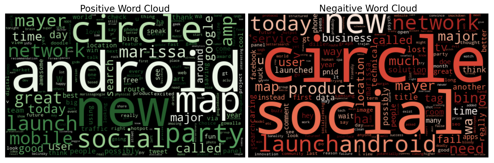
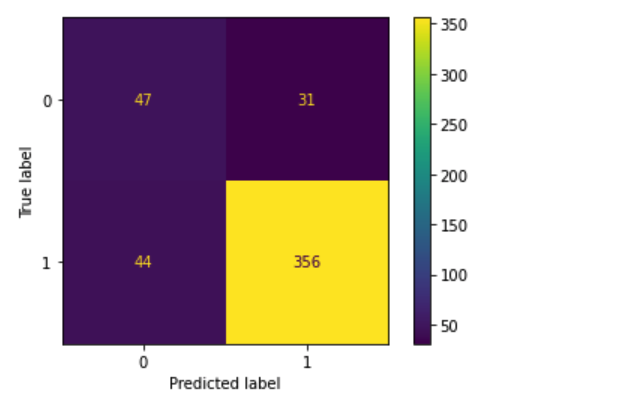

# Analyzing Consumer Sentiment  with NLP, Scikit-Learn & Keras
Author: Pharoah Evelyn  
<p align="center">

</p>
    
## Overview

#### This notebook aims to analyze Twitter data for sentiment and build a model that can best predict Twitter sentiment.

This notebook will discover what users say about Apple & Google products en masse using NLP techniques.
Discovery is started by incorporating Tokenization, the removal of stopwords, and the use of Lemmatization on corpus made from the data.

I followed by identifying sentiment as the target data. Approaching this as a classification problem led to a straightforward model selection. Next, I try some Sklearn models after using a TF-IDF vectorizer, followed by Keras modeling.

## Business Problem
Tech news company Engadget needs to analyze Twitter sentiment to analyze the trends related to Apple vs. Google products during a South by South West (SXSW) event. They need this to provide appropriate coverage on their content platform & subscriber list.

Mining sentiment on Twitter can help entities quickly gauge user opinion on a mass scale and use this information to improve their products and services. Furthermore, having a deep understanding of general consensuses will help the recommendation process.

## Data Preparation

We use a dataset that displays consumer sentiment regarding products released during SXSW.
The data file is in this GitHub Repository as `judge-1377884607_tweet_product_company.csv`

Once I imported the data, I performed EDA to ensure that this data was usable before employing the functions we needed to solve our business problem.

The data, in this case, had multiple null values throughout the data, and the original column names were long and challenging to read.
After this, I can split the data into ways we need to run NLP analysis and build prediction models.

## Methods Used
Once the data was processed, we split the information for NLP analysis. Tokenization, removal of stopwords, and Lemmatization took place on the corpus from the dataframe.

Next, a function to identify context around words was used so we could add new items to the stopwords list if necessary. After that, I  generated a set of word clouds to look at how sentiment compares between positive & negative tweets as a whole; and another set for either company. 

Furthermore, I create more word clouds for the sentiment of tweets categorized by each company for further insight.

Once satisfied, we identified the target column & ran the data through various ML algorithms. Followed by Keras modeling to see if we can get even better results.
Most algorithms ran with near-vanilla parameters; only one Keras model used tuned parameters.
I also configured each run to return a confusion matrix; classification reports with error scores and ROC curves are displayed on the Scikit-Learn models.

Below are the results!

## NLP Analysis


#### How does Apple compare to Google in sentiment analysis?
Google & Apple appeared to have strikingly similar levels of positive sentiment over their products, so there isn't a real winner here.  


#### What are people most excited about?
It appears people are most excited about new products all around. As expected for new releases at significant events such as SXSW.

#### For Apple:
All Apple words -  


Apple words without products -  


Positive & Negative Apple words -  


We see much excitement for a popup store & its location downtown, which sells the latest products.

Unfortunately, we can see that some apple users are experiencing issues with their battery life. Some users also do not approve of Apple's new product design. Also, it seems some people are calling Apple fascist.

#### For Google:
All Google words -  


Google words without products -  


Positive & Negative Google words -  


There is much buzz for Google Circle (a social network) in this dataset and Google Maps. We also see much mention of Marissa Mayer, a prolific businesswoman.

We also see that some users are experiencing interface issues in the same breath.

#### What can we gain from this information?
We can gain that though there was a bunch of positivity in our dataset of tweets, we can perceive a level of mixed reception since the negatives show discontent with the launch of products, new features & new designs of various products.

## Models
For ease of viewing, the top 3 models are displayed here. For more results, please see my accompanying jupyter notebook in this repository!

#### Logistic Regression
  
Interpretation of negative sentiment with a Logistic Regression classifier:
* 44 True Negatives: Tweets with negative sentiment
* 34 False Positives: Predicted tweets with positive sentiment, but they're negative
* 33 False Negatives: Predicted tweets with negative sentiment, but they're positive
* 367 True Positives: Tweets with positive sentiment

#### Keras Model
  
Interpretation of negative sentiment with a simple Keras model:
* 38 True Negatives: Tweets with negative sentiment
* 40 False Positives: Predicted tweets with positive sentiment, but they're negative
* 41 False Negatives: Predicted tweets with negative sentiment, but they're positive
* 359 True Positives: Tweets with positive sentiment

#### Keras Model with Parameter Tuning
  
Interpretation of negative sentiment with a Keras model with some parameter tuning:
* 47 True Negatives: Tweets with negative sentiment
* 31 False Positives: Predicted tweets with positive sentiment, but they're negative
* 44 False Negatives: Predicted tweets with negative sentiment, but they're positive
* 356 True Positives: Tweets with positive sentiment

## Conclusions
#### The best model is a Keras Model with Parameter Tuning.

This is because: 
* The confusion matrix reports a higher correct classification of 0: negative sentiment.
    * The vanilla Keras model presents a higher peak validation accuracy score of 88.93% (vs. 86.45% after parameter tuning)
* The Scikit-Learn models all performed well on the accuracy, but none of their accuracy scores performed better than either Keras model.
    * However, the vanilla Linear SVC model comes close at 86.82% accuracy.
* The Logistic Regression model is the second-best performing model for predicting negative sentiment, with 44 correct predictions.

## Recommendations
#### Usage for our model:
* Use this model to predict Twitter sentiment for future events, or even with a live API
* Use this model to predict if negative tweets are about Apple or Google
    * You can do this by splitting the original dataframe only to include negative tweets and have the products be the target column
* Build a web app using techniques in this notebook to predict twitter sentiment

#### Suggestions:
* To further increase model performance, we could implement a grid search on all models to discover if higher model performance is probable.

## Next Steps
* Engadget can publish various news articles targeted to their audience about the different findings this notebook uncovers
    * Apple articles targeted at Apple enthusiasts
    * Google articles targeted at Google enthusiasts
    * Negative or positive press about this particular SXSW as a whole
    * Etc.
* Run similar analysis on future events or tech releases. Thus providing timely updates to enthusiasts & avid readers.
## Repository Structure
A description of the structure of this repository and its contents:
```
└── images                              <- Both sourced externally and generated from code
├── data                                <- Sourced externally from code
├── Analyzing_Twitter_Sentiment.ipynb   
    ^^ Narrative documentation of analysis in Jupyter notebook
├── Analyzing_Twitter_Sentiment.pdf       <- PDF version of project presentation
├── README.md                           <- The top-level README for reviewers of this project

```